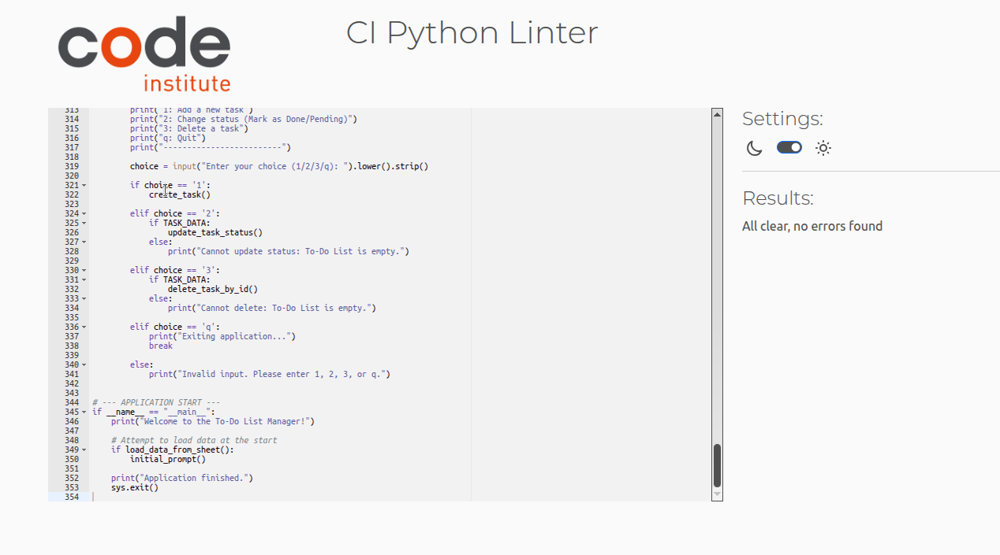

# To-Do List Manager (Google Sheets CLI)

This project is a Command-Line Interface (CLI) application developed in Python that acts as a To-Do List manager. It uses the **Google Sheets API** as its primary database, allowing users to perform full CRUD operations (Create, Read, Update Status, Delete) on their tasks.

## 🎯 Project Value and Features

The application provides a simple, robust, and platform-agnostic way to manage tasks directly from the terminal while ensuring all data is persisted and accessible via a standard Google Sheet.

**Core Features:**

- **View Tasks (Read):** Displays the current to-do list, sorted by completion status and priority.
- **Add Task (Create):** Allows users to add a new task with a description and priority level.
- **Update Status (Update):** Users can mark a task as 'DONE' or 'PENDING' by its unique ID.
- **Delete Task (Delete):** Permanently removes a task from the list and the Google Sheet.
- **Data Persistence:** All changes are immediately synchronized with the Google Sheet.

## 💻 Application Logic and Data Flow

The To-Do List Manager operates through a continuous loop in the command line, providing users with a real-time interface to manipulate cloud-based data.

### 1. Initialization and Data Load

- Authorization: The application first establishes a secure connection to Google Sheets using credentials from the local creds.json file.
- Data Fetch: It opens the designated spreadsheet ('to_do_list') and loads all content from the 'tasks' worksheet.
- Data Conversion: All sheet values are immediately converted into a local Python data structure: a list of dictionaries (TASK_DATA). This list serves as the application's working memory.

### 2. Main Loop and User Interaction

The application enters an interactive loop (initial_prompt) where the user can choose from the following operations:

- View Tasks (Read): The list is displayed, sorted first by done status (pending tasks first) and then by priority (High to Low).
- Add Task (Create):

  - The user provides a description and priority (1-3).
  - A new unique id is generated (maximum existing ID + 1).
  - The new task is appended to the Google Sheet (API call).
  - The new task dictionary is immediately appended to the local TASK_DATA.

- Update Status (Update):
  - The user enters a task id.
  - The task is found in the local TASK_DATA (using get_task_by_id).
  - The task's done status is toggled (True/False) locally.
  - The corresponding cell in the Google Sheet (Column D) is updated using the tasks.find() method to locate the correct row by id.
- Delete Task (Delete):
  - The user enters a task id.
  - The task's row is found in the Google Sheet using tasks.find(id, in_column=1).
  - The entire row is deleted from the Google Sheet (API call).
  - The task is removed from the local TASK_DATA list using a list comprehension filter.

### 3. Data Integrity and Error Handling

- Synchronization: All mutations (Create, Update, Delete) are performed first on the cloud and then synchronized locally, ensuring data persistence.
- Input Validation: User input (e.g., priority level, task ID) is checked to handle empty or non-numeric values, preventing application crashes and ensuring a smooth user experience.
- API Errors: Comprehensive try/except blocks are used to catch critical errors, such as connection failures or API limitations.

## 🖼️ Usage Examples and Manual Testing

The following screenshots demonstrate the core functionalities of the To-Do List Manager in the command-line interface.

### 1. Application Start (Read Functionality)


This image shows the initial successful connection to Google Sheets and the display of the main menu and current tasks.

### 2. Creating a New Task (Create Functionality)


These screenshots show the interactive process of adding a new task, including input validation for description and priority, and the final success message.

### 3. Changing Task Status (Update Functionality)


These images illustrate the process of toggling a task's status between 'PENDING' and 'DONE' by entering its unique ID.

#### Status Change Confirmation


### 4. Deleting a Task (Delete Functionality)


This screenshot verifies the successful deletion of a task using its ID, which also updates both the local list and the Google Sheet.

### 5. Application Exit


This shows the user successfully exiting the interactive application loop.

## 🔬 Code Validation (PEP8 Compliance)

The application code has been verified against Python's official style guide (PEP8) using a CI Python Linter.



## 🛠️ Setup and Installation

### 1. Prerequisites

You must have the following installed:

- Python 3.12 (or higher)
- Git

### 2. Google Sheets API Setup

his application requires its own dedicated Google Sheet for data persistence via the Service Account credentials.

### Prerequisites

1.  **Duplicate the Template:** Start by duplicating the required spreadsheet template to your own Google Drive account:
    - **Template Link:** `https://docs.google.com/spreadsheets/d/1ueEQWwzt-iExx6UG-43zQf2hOgGXsswGgNoMfznSguE/edit?usp=sharing`
    - **IMPORTANT:** After duplicating, ensure you use **your new spreadsheet's unique URL** for all subsequent steps.
2.  **Verify Worksheet:** Ensure the first worksheet in your copy is named **`tasks`** and has the mandatory headers in the first row: `id`, `task`, `priority`, `done`.

### API Access and Authentication

1.  **Enable API Access:**
    - Go to the Google Cloud Console.
    - Enable the **Google Drive API** and **Google Sheets API** for your project.
2.  **Create Service Account Key:**
    - Create a new Service Account and download the JSON key file.
    - **Rename this file to `creds.json`** and place it in the root directory of this project.
3.  **Share Your Sheet:** **Share** **your duplicated Google Sheet** with the **client email address** found in your `creds.json` file. Grant **Editor** access.

### 3. Running the Application Locally

1.  **Clone the Repository:**
    ```bash
    git clone [YOUR_REPOSITORY_URL]
    cd [YOUR_REPOSITORY_NAME]
    ```
2.  **Create Virtual Environment:**
    ```bash
    python3 -m venv .venv
    ```
3.  **Activate Virtual Environment:**
    - _Linux/macOS:_ `source .venv/bin/activate`
    - _Windows (PowerShell):_ `.\.venv\Scripts\Activate`
4.  **Install Dependencies:**
    ```bash
    pip install -r requirements.txt
    ```
5.  **Run the Application:**
    ```bash
    python run.py
    ```

## ☁️ Deployment (Heroku)

This application is designed to run as a **Worker Dyno** on the Heroku cloud platform, constantly managing the application's logic and data synchronization. This process satisfies **Criterion 9.1** (Deployment to a cloud platform).

### Prerequisites

Before starting the deployment, ensure the following files are committed to your GitHub repository:

1.  **`run.py`** (The main application file)
2.  **`requirements.txt`** (Contains all Python dependencies)
3.  **`Procfile`** (Specifies how to run the worker)

### 1. Creating the Procfile

The `Procfile` (no file extension) must be in the root directory. It instructs Heroku on the command to execute to start your CLI application:

```bash
    python3 -m venv .venv
```

### 2. Configure Heroku Application

1.  **Create App:** Log in to Heroku and create a new application, connecting it to your GitHub repository.
2.  **Deployment Method:** Configure automated deployment from your main branch.

### 3. Setting the `CREDS_JSON` Variable (Crucial Step)

Heroku cannot store files like `creds.json`. To grant your deployed app access to Google Sheets, you must securely store the file content as an environment variable.

1.  Go to **Settings** -> **Reveal Config Vars** in your Heroku dashboard.
2.  **Key:** Enter `CREDS_JSON`.
3.  **Value:** Copy the **entire text** content of your local `creds.json` file (including all formatting and curly braces `{}`) and paste it here.

### 4. Final Deploy and Interaction

1.  **Final Commit:** Ensure all project files, including `Procfile` and the clean `run.py`, are committed to GitHub.
2.  **Deploy:** Trigger the deployment on Heroku.
3.  **Interaction Method (CRITICAL):** Since this is a CLI application, you **cannot** interact with it via the standard Heroku logs or a web browser.

    - You must use the **Heroku CLI** to launch an interactive session (One-Off Dyno).
    - **Command to run the application:**
      ```bash
      heroku run python run.py --app YOUR_APP_NAME
      ```
    - This command opens a temporary, interactive terminal connected to your application, allowing you to use all menu options (1, 2, 3, q).

4.  **Optional: Disable Worker Dyno:** If you are not running continuous background tasks, you should **disable** the Worker Dyno in the **Resources** tab to prevent constant crashes and save free dyno hours.
