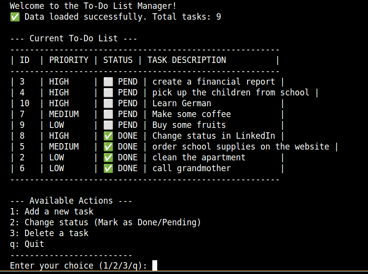
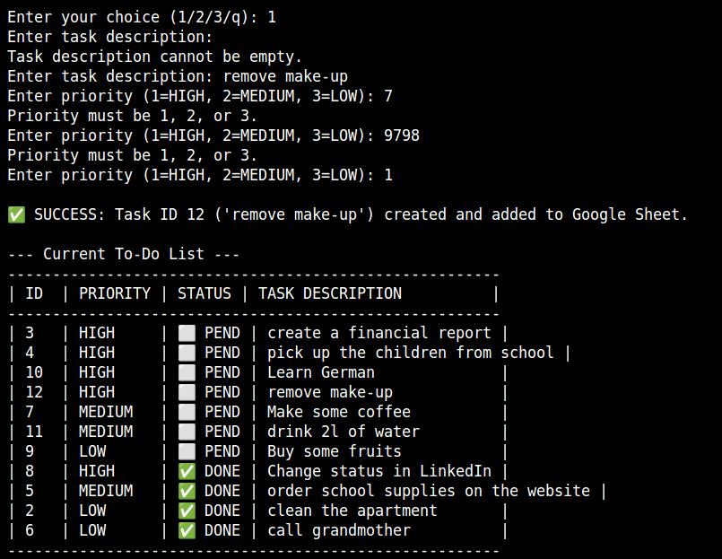
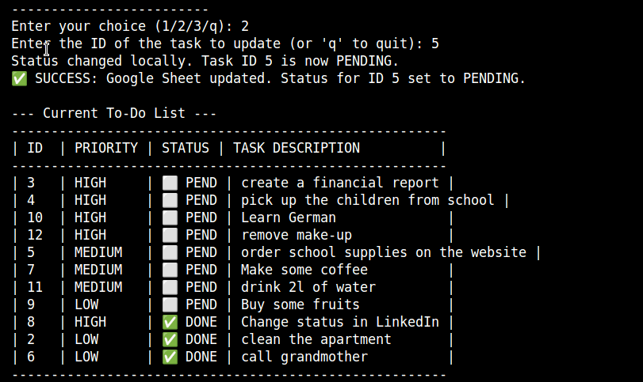
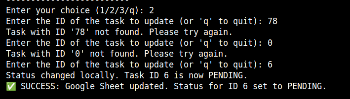
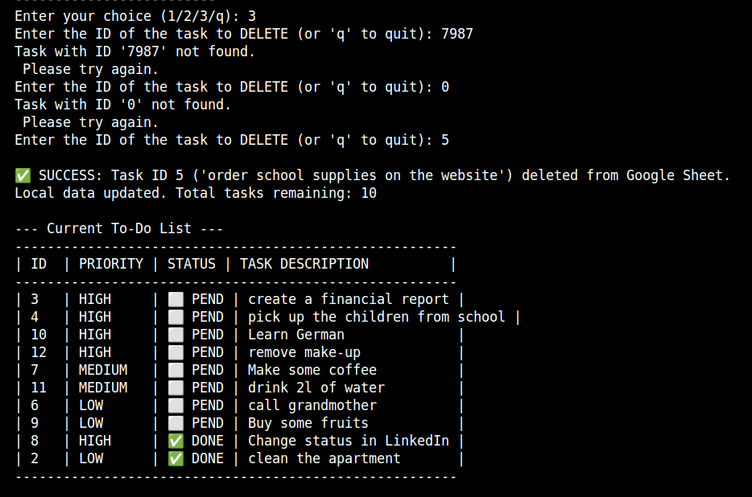
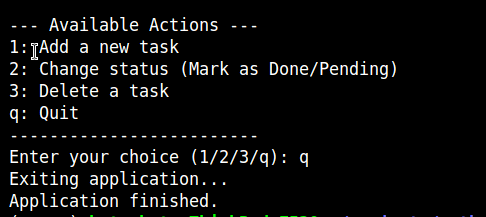

# To-Do List Manager (Google Sheets CLI)

This project is a Command-Line Interface (CLI) application developed in Python that acts as a To-Do List manager. It uses the **Google Sheets API** as its primary database, allowing users to perform full CRUD operations (Create, Read, Update Status, Delete) on their tasks.

## 🎯 Project Value and Features

The application provides a simple, robust, and platform-agnostic way to manage tasks directly from the terminal while ensuring all data is persisted and accessible via a standard Google Sheet.

**Core Features:**

- **View Tasks (Read):** Displays the current to-do list, sorted by completion status and priority.
- **Add Task (Create):** Allows users to add a new task with a description and priority level.
- **Update Status (Update):** Users can mark a task as 'DONE' or 'PENDING' by its unique ID.
- **Delete Task (Delete):** Permanently removes a task from the list and the Google Sheet.
- **Data Persistence:** All changes are immediately synchronized with the Google Sheet.

## 💻 Application Logic and Data Flow

The To-Do List Manager operates through a continuous loop in the command line, providing users with a real-time interface to manipulate cloud-based data.

### 1. Initialization and Data Load

- Authorization: The application first establishes a secure connection to Google Sheets using credentials from the local creds.json file.
- Data Fetch: It opens the designated spreadsheet ('to_do_list') and loads all content from the 'tasks' worksheet.
- Data Conversion: All sheet values are immediately converted into a local Python data structure: a list of dictionaries (TASK_DATA). This list serves as the application's working memory.

### 2. Main Loop and User Interaction

The application enters an interactive loop (initial_prompt) where the user can choose from the following operations:

- View Tasks (Read): The list is displayed, sorted first by done status (pending tasks first) and then by priority (High to Low).
- Add Task (Create):

  - The user provides a description and priority (1-3).
  - A new unique id is generated (maximum existing ID + 1).
  - The new task is appended to the Google Sheet (API call).
  - The new task dictionary is immediately appended to the local TASK_DATA.

- Update Status (Update):
  - The user enters a task id.
  - The task is found in the local TASK_DATA (using get_task_by_id).
  - The task's done status is toggled (True/False) locally.
  - The corresponding cell in the Google Sheet (Column D) is updated using the tasks.find() method to locate the correct row by id.
- Delete Task (Delete):
  - The user enters a task id.
  - The task's row is found in the Google Sheet using tasks.find(id, in_column=1).
  - The entire row is deleted from the Google Sheet (API call).
  - The task is removed from the local TASK_DATA list using a list comprehension filter.

### 3. Data Integrity and Error Handling

- Synchronization: All mutations (Create, Update, Delete) are performed first on the cloud and then synchronized locally, ensuring data persistence.
- Input Validation: User input (e.g., priority level, task ID) is checked to handle empty or non-numeric values, preventing application crashes and ensuring a smooth user experience.
- API Errors: Comprehensive try/except blocks are used to catch critical errors, such as connection failures or API limitations.

## 🖼️ Usage Examples and Manual Testing

The following screenshots demonstrate the core functionalities of the To-Do List Manager in the command-line interface.

### 1. Application Start (Read Functionality)

This image shows the initial successful connection to Google Sheets and the display of the main menu and current tasks.

### 2. Creating a New Task (Create Functionality)

These screenshots show the interactive process of adding a new task, including input validation for description and priority, and the final success message.

### 3. Changing Task Status (Update Functionality)

These images illustrate the process of toggling a task's status between 'PENDING' and 'DONE' by entering its unique ID.

#### Status Change Confirmation

### 4. Deleting a Task (Delete Functionality)

This screenshot verifies the successful deletion of a task using its ID, which also updates both the local list and the Google Sheet.

### 5. Application Exit

This shows the user successfully exiting the interactive application loop.
